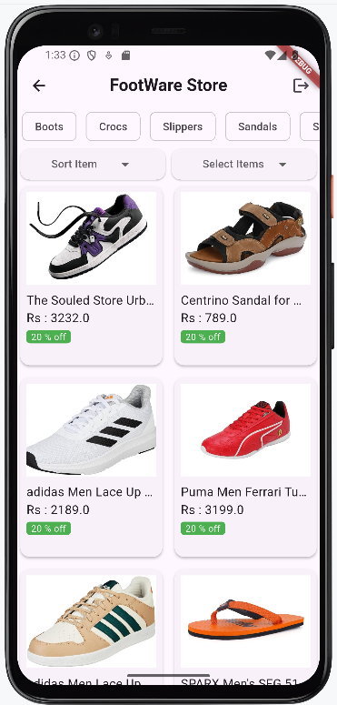
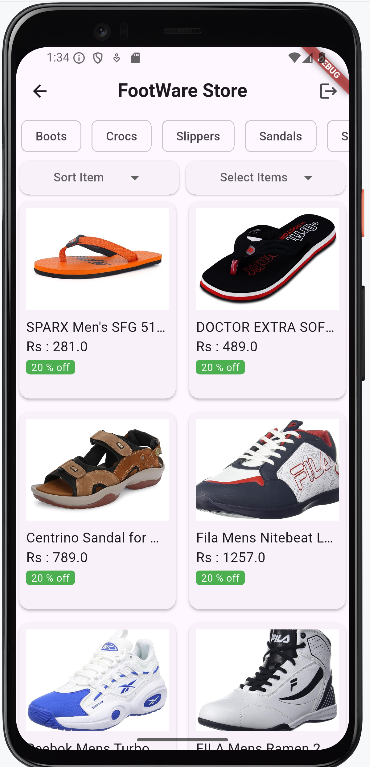
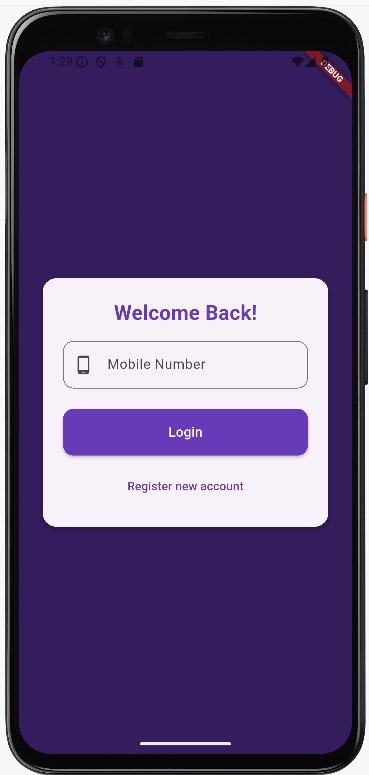
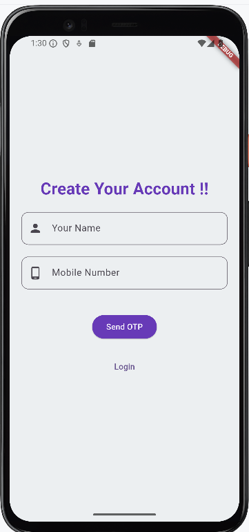
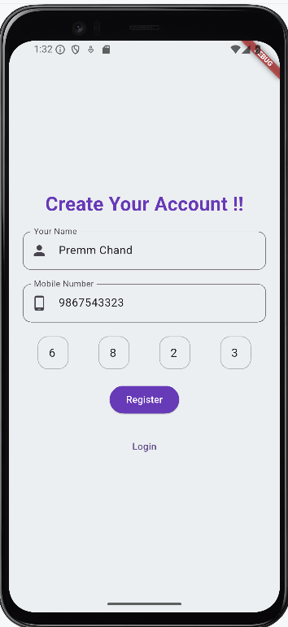
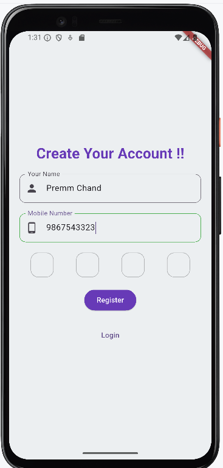
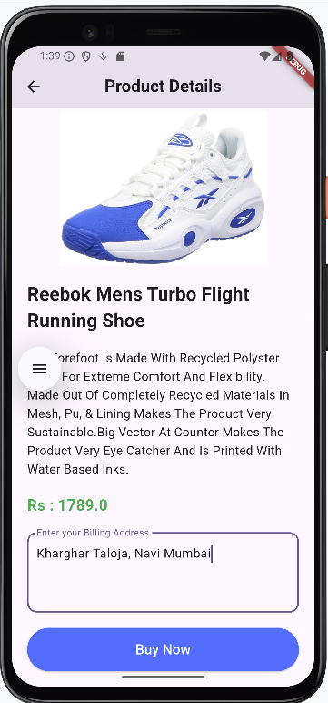
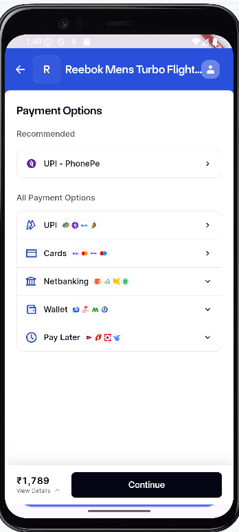
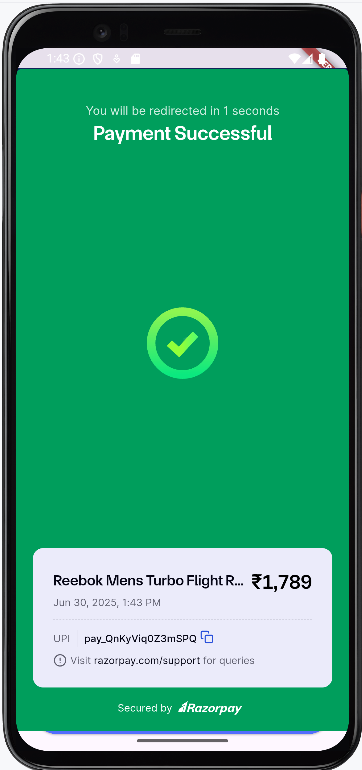
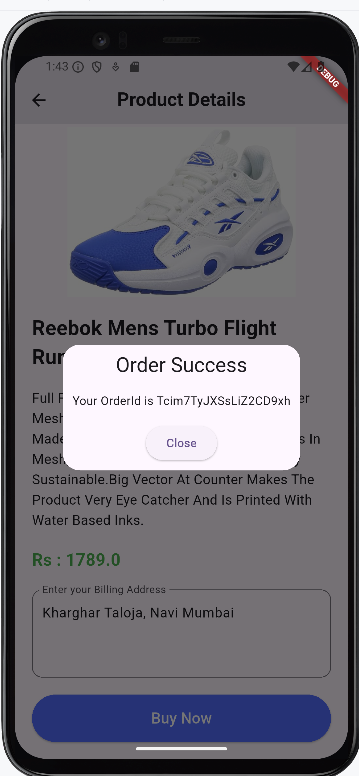

ClickKart Client App

ClickKart Client is a modern e-commerce Flutter application designed with a smooth user experience in mind. 
It integrates Firebase for backend services, Razorpay for secure payments, 
and uses GetX for efficient state management.

---

## 🚀 Features

- 🔐 **OTP Authentication** (Firebase Phone Auth)
- 🛍️ **Product Listing**, Filtering, and Sorting
- 💳 **Razorpay Payment Gateway Integration**
- 📦 **Order Management System**
- ☁️ **Firebase Firestore** as Backend Database
- ⚙️ **GetX** for State Management

---

## 📱 App Screenshots

<p float="left">
  
  
</p>

<p float="left">
  
  
</p>

<p float="left">
  
  
</p>

<p float="left">
  
  
</p>

<p float="left">
  
  
</p>

<p float="left">
  
  
</p>

---

## 🧠 Tech Stack

- **Flutter**
- **Firebase (Auth & Firestore)**
- **Razorpay Flutter SDK**
- **GetX (Routing, State & Dependency Management)**

---

## 📂 Project Structure

clickkart_client/
│
├── assets/
│ └── images/
│ └── *.png (Screenshots & UI assets)
│
├── lib/
│ ├── controller/
│ ├── model/
│ ├── pages/
│ └── main.dart

yaml
Copy
Edit

---

## 📦 Setup & Run

1. Clone this repository:
   ```bash
   git clone https://github.com/PremmChand/clickkart_client.git
   cd clickkart_client
Install dependencies:

flutter pub get
Run the app:

flutter run
🙌 Contribution
Contributions are welcome! Feel free to open issues or submit pull requests.

📃 License
This project is licensed under the MIT License. See LICENSE for details.

Built with ❤️ using Flutter by Premm Chand

